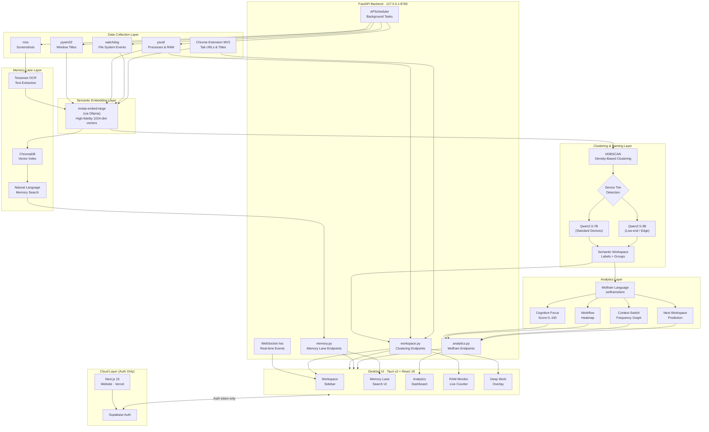

# KNEMOS

> **K**nowledge · **Nem**onics · **OS**
> *The Cognitive Layer for Your Desktop*


```text
  ██╗  ██╗███╗   ██╗███████╗███╗   ███╗ ██████╗ ███████╗
  ██║ ██╔╝████╗  ██║██╔════╝████╗ ████║██╔═══██╗██╔════╝
  █████╔╝ ██╔██╗ ██║█████╗  ██╔████╔██║██║   ██║███████╗
  ██╔═██╗ ██║╚██╗██║██╔══╝  ██║╚██╔╝██║██║   ██║╚════██║
  ██║  ██╗██║ ╚████║███████╗██║ ╚═╝ ██║╚██████╔╝███████║
  ╚═╝  ╚═╝╚═╝  ╚═══╝╚══════╝╚═╝     ╚═╝ ╚═════╝ ╚══════╝

  AI-Powered Semantic Workspace Operating System
```

---

# What is KNEMOS?

KNEMOS is a **local-first AI-powered cognitive operating layer** that continuously understands, organizes, and enhances a user's digital workspace.

Instead of treating browser tabs, applications, files, terminals, and documents as isolated resources, KNEMOS automatically groups them into intelligent semantic workspaces based on context, intent, and activity.

The result is a computing experience where your system understands **what you are working on**, not just **which application is open**.

---

## Why KNEMOS Exists

Modern operating systems were designed around files and folders—an interaction model that has remained largely unchanged for decades.

Today's knowledge workers operate across:

* 40+ browser tabs
* Multiple IDEs and terminals
* Cloud documents and local files
* Messaging and collaboration platforms
* AI assistants and research tools

Although these resources often belong to the same project, operating systems treat them as completely unrelated entities.

This creates a persistent productivity problem:

* Frequent context switching
* Lost research and forgotten information
* Fragmented workflows
* Reduced focus and cognitive efficiency
* Excessive resource consumption from inactive workspaces

KNEMOS was created to bridge this gap by introducing a semantic layer between the user and the operating system.

> *"A cognitive operating layer between the user and their computer."*

---

# The Numbers

Modern knowledge work is increasingly fragmented across applications, browser tabs, files, and communication tools. This fragmentation creates measurable productivity and performance costs.

| Challenge                                         | Impact           |
| ------------------------------------------------- | ---------------- |
| Average browser tabs per active session           | 40+              |
| Productive time lost to context switching         | ~20 minutes/day  |
| Memory consumed by inactive browser tabs          | Up to 4.3 GB RAM |
| Deep-work efficiency lost to fragmented workflows | ~40%             |

These metrics highlight a fundamental limitation of traditional operating systems: they manage applications and files, but they do not manage context.

---

# Product Ecosystem

KNEMOS is delivered as three interconnected components that work together to create a unified cognitive workspace.

```text
                    KNEMOS Ecosystem

 ┌─────────────┐     ┌─────────────────────┐     ┌─────────────────┐
 │   Website   │     │     Desktop App     │     │ Browser Extension│
 │             │     │    (Core Engine)    │     │                 │
 │ Next.js 15  │────▶│ Tauri v2            │◀────│ Chrome MV3      │
 │ Vercel      │     │ FastAPI Backend     │     │ Tab Activity    │
 │ Supabase    │     │ Local AI Engine     │     │ URL Metadata    │
 └─────────────┘     └─────────────────────┘     └─────────────────┘
```


### Component Overview

**Desktop Application**

* Primary user interface
* Semantic workspace management
* Search, analytics, and productivity dashboard
* Built with Tauri v2 and React

**Browser Extension**

* Captures browser context and tab metadata
* Streams workspace information to the local AI backend
* Enables semantic grouping of web-based activities

**Local AI Backend**

* Processes activity data locally
* Generates embeddings and semantic clusters
* Powers Memory Lane, analytics, and workspace intelligence
* Ensures user data remains on-device

---

# Core Features

## 01 · Semantic Workspace Clustering

KNEMOS automatically organizes browser tabs, VS Code windows, terminal sessions, documents, and folders into intelligent semantic workspaces.

Instead of manually creating folders, tags, or project groups, the system understands contextual relationships and builds workspace structures automatically.

### Example Transformation

```text
BEFORE

github.com/VendorBridge
auth.py (VS Code)
FastAPI Documentation
Terminal #3
Stack Overflow
YouTube Tab #27
Gmail (4 tabs)
Slack
```

```text
AFTER

VendorBridge Development
├─ GitHub Repository
├─ FastAPI Documentation
├─ auth.py
└─ Terminal Session

Research Workspace
├─ Documentation
├─ Stack Overflow
└─ Reference Materials

Communication
├─ Gmail
├─ Slack
└─ Notifications
```

### Benefits

* No manual organization
* Reduced context switching
* Cleaner digital workspace
* Faster project navigation
* Improved focus and task continuity

---

## 02 · Memory Lane

Memory Lane transforms your digital activity into a searchable knowledge timeline.

The system periodically captures workspace state, performs OCR on screenshots, generates semantic embeddings, and indexes everything into ChromaDB for natural-language retrieval.

### Example Query

```text
Search:
"that React authentication bug from this morning"
```

### Result

```text
✓ Screenshot
✓ Timestamp
✓ Related Workspace
✓ Open Tabs
✓ Associated Files
✓ Complete Workspace State
```

### Capabilities

* Search past work using natural language
* Recover forgotten information instantly
* Locate screenshots, documents, and sessions
* Navigate historical workspace states
* Build a searchable memory layer for the entire desktop

```
```
## Semantic Desktop Search (ChromaDB)

Memory Lane is powered by a semantic search layer built on ChromaDB, allowing users to retrieve historical information using concepts rather than exact keywords.

### Key Capabilities

**Local Embeddings**

* Text extracted from screenshots and workspace activity is converted into high-dimensional semantic vectors using `mxbai-embed-large`.
* All embedding generation occurs locally through Ollama.

**Concept-Based Retrieval**

* Search by meaning instead of exact matches.
* Example: searching for **"vacation"** can surface screenshots containing related terms such as **"Hawaii"**, **"travel itinerary"**, or **"hotel booking"**.

**Persistent Memory Index**

* Creates a searchable knowledge layer across screenshots, documents, browser sessions, and workspace activity.

---

## 02.5 · Wolfram Intelligence Layer

The Wolfram Intelligence Layer provides advanced computational analytics on top of workspace activity data.

### Core Functions

**Computational Analytics**

* Productivity forecasting
* Context-switch analysis
* Cognitive workload measurement
* Workspace relationship mapping

**Optional Architecture**

* KNEMOS remains fully functional without Wolfram Engine.
* When unavailable, the system automatically falls back to Python-based analytical models.

**100% Local Processing**

* No cloud inference
* No external analytics services
* All computations execute on the user's machine

### Memory Processing Pipeline

```text
Screenshot Capture (mss)
          ↓
OCR Extraction (Tesseract)
          ↓
Semantic Embeddings (mxbai-embed-large)
          ↓
ChromaDB Vector Storage
          ↓
Natural Language Search & Retrieval
```

---

## 03 · Deep Work Mode

Deep Work Mode actively reduces workspace distractions by identifying applications, windows, and browser tabs that are unrelated to the current semantic workspace.

### Features

* Off-context application detection
* Workspace-aware focus environment
* Automatic distraction reduction
* Cleaner visual workspace
* Improved task continuity

The objective is to maintain cognitive flow and reduce unnecessary context switching during focused work sessions.

---

## 04 · RAM Recovery Engine

The RAM Recovery Engine continuously monitors system resources and intelligently hibernates inactive workspaces.

### Capabilities

* Workspace hibernation
* Memory optimization
* CPU usage reduction
* Live resource monitoring
* Real-time savings dashboard

### Example Output

```text
AI recovered 4.3 GB RAM
12 inactive tabs hibernated
Resource usage reduced by 27%
```

---

## 05 · Predictive Productivity Analytics

Workspace activity is processed through the Wolfram analytics layer to generate measurable productivity insights.

### Generated Metrics

**Cognitive Focus Score**

* Daily focus rating from 0–100
* Based on activity continuity and interruption patterns

**Workflow Heatmap**

* Identifies peak productivity periods
* Visualizes focus intensity throughout the day

**Context-Switch Frequency**

* Measures how often users move between unrelated tasks
* Helps identify productivity bottlenecks

**Next Workspace Prediction**

* Predicts the most likely workspace a user will return to
* Enables proactive context restoration

---

## 06 · Context Export

Every semantic workspace can be exported as a portable, structured Markdown package.

### Export Contents

* Browser links
* File references
* Workspace metadata
* Session history
* Context summaries
* Related resources

This allows users to archive, share, or transfer complete workspace contexts without losing organizational structure.

---

# AI Pipeline

The KNEMOS intelligence layer follows a six-stage processing pipeline.

### Step 1 — Data Collection

Sources:

* `psutil` (running processes)
* `pywin32` (window titles)
* `watchdog` (file activity)
* `mss` (screenshots)
* Chrome Extension (tab URLs and metadata)

Output:

* Unified workspace activity stream

---

### Step 2 — Semantic Embeddings

Model:

* `mxbai-embed-large` via Ollama

Purpose:

* Convert textual metadata into semantic vector representations

Output:

* High-fidelity embeddings for search and clustering

---

### Step 3 — Workspace Clustering

Algorithm:

* HDBSCAN

Purpose:

* Group semantically related resources into meaningful workspaces

Output:

* Dynamic semantic workspace clusters

---

### Step 4 — Workspace Naming

Models:

* `Qwen2.5-7B` (standard devices)
* `Qwen2.5-3B` (low-resource devices)

Purpose:

* Generate human-readable workspace names
* Infer project intent and context

Output:

* Intelligent workspace labels

---

### Step 5 — Memory Indexing

Components:

* Tesseract OCR
* ChromaDB

Purpose:

* Transform screenshots into searchable memory records

Output:

* Long-term semantic memory index

---

### Step 6 — Workflow Analytics

Engine:

* Wolfram Language (`wolframclient`)

Purpose:

* Analyze workspace behavior over time

Output:

* Focus Score
* Productivity Heatmaps
* Context-Switch Analytics
* Predictive Insights

---

> **Local-First Architecture:** All processing runs through the local backend at `127.0.0.1:8765`. User data, screenshots, embeddings, and analytics never leave the machine unless explicitly exported by the user.


## Technology Stack

| Layer | Technologies |
|-------|-------------|
| **Frontend** | React 18, TailwindCSS, Framer Motion, Zustand |
| **Desktop Shell** | Tauri v2 (Rust-native backend) |
| **AI Backend** | FastAPI, Python 3.11, APScheduler, WebSockets |
| **AI / ML** | mxbai-embed-large, HDBSCAN, Ollama + Qwen2.5-7B / Qwen2.5-3B |
| **Vector DB** | ChromaDB |
| **OCR** | Tesseract |
| **Analytics** | Wolfram Language, wolframclient |
| **System Monitor** | pywin32, psutil, watchdog, mss |
| **Browser Layer** | Chrome Extension MV3, Native Messaging API |
| **Auth** | Supabase Auth |
| **Website** | Next.js 15, TailwindCSS, Framer Motion |
| **Deployment** | Vercel |

### Why Tauri over Electron?

| Metric | Electron | Tauri v2 |
|--------|----------|----------|
| RAM usage | ~200 MB | ~30 MB |
| Bundle size | ~150 MB | ~10 MB |
| Backend language | JavaScript | Rust |
| Startup speed | Slow | Fast |

### Qwen2.5 Model Variants

| Variant | VRAM / RAM | Target Device | Use Case |
|---------|-----------|---------------|----------|
| Qwen2.5-7B | ~6 GB | Standard laptops / desktops | Full workspace naming & reasoning |
| Qwen2.5-3B | ~3 GB | Low-end / edge devices | Lightweight workspace naming |

KNEMOS auto-detects available system memory at startup and selects the appropriate model variant.

---

# Architecture

KNEMOS follows a local-first, modular architecture designed to understand, organize, and optimize digital workspaces without relying on cloud processing.

The platform consists of six primary layers:

| Layer                 | Responsibility                                                                               |
| --------------------- | -------------------------------------------------------------------------------------------- |
| Data Collection       | Captures workspace activity from the operating system, browser, file system, and screenshots |
| Semantic Intelligence | Generates embeddings and semantic representations of activity                                |
| Workspace Engine      | Clusters related resources and generates workspace identities                                |
| Memory Layer          | Creates a searchable historical memory of user activity                                      |
| Analytics Layer       | Computes focus, productivity, and workflow insights                                          |
| Desktop Interface     | Presents workspaces, memory, analytics, and controls to the user                             |

### Architectural Principles

* **Local-First Processing** — Core intelligence executes entirely on-device.
* **Privacy by Default** — Workspace history, screenshots, embeddings, and analytics remain local.
* **Semantic Understanding** — Resources are organized by meaning rather than application boundaries.
* **Modular Design** — Individual subsystems can evolve independently.
* **Resource Efficiency** — Optimized for desktop environments using lightweight technologies such as Tauri and FastAPI.

### System Architecture Diagram



### Processing Flow

```text
Activity Collection
        ↓
Semantic Embeddings
        ↓
Workspace Clustering
        ↓
Workspace Naming
        ↓
Memory Indexing
        ↓
Analytics Generation
        ↓
Desktop Experience
```

> **Privacy Guarantee:** All workspace intelligence, embeddings, screenshots, analytics, and memory indexing execute locally through the FastAPI backend. Cloud services are limited to authentication, updates, and optional telemetry.


## Getting Started

### Prerequisites

```bash
# System
Windows 10/11 (MVP scope)
Node.js >= 18
Python 3.11
Rust (for Tauri)  https://rustup.rs
Ollama  https://ollama.ai

# Ollama models
ollama pull mxbai-embed-large          # Embedding model
ollama pull qwen2.5:7b                 # Standard devices
ollama pull qwen2.5:3b                 # Low-end / edge devices
```

### Using the App (End Users)

If you downloaded the `KNEMOS.exe` release, you **DO NOT** need to install Node.js, Rust, or run the frontend. You only need to run the AI backend.

```bash
# 1. Download and open KNEMOS.exe
# 2. Run the local AI Backend engine:
cd WEBSITE/BACKEND
pip install -r requirements.txt
## ⚙️ Setup & Installation

We provide two paths: one for regular users, and one for developers.

### 1. For Regular Users (The `.exe`)
When you download the packaged KNEMOS `.exe`, the entire React/Tauri frontend is bundled natively inside the app! You do **not** need Node.js or `npm run tauri dev`. 

You only need to ensure the backend dependencies are running:
1. **Ollama**: Download from ollama.com, install `qwen2.5:7b` and `mxbai-embed-large`.
2. **Wolfram Engine** (Optional): Install the free Wolfram Engine 14.3 for advanced analytics.
3. **Backend Server**: Run the Python FastAPI backend via `uvicorn main:app --port 8765`. (In the future, this will also be bundled into the exe).

### 2. For Developers (Building from Source)

If you want to modify the code, follow these steps:

#### Step 1: Clone & Install
```bash
git clone https://github.com/Ahad-Dngwala/KNEMOS.git
cd KNEMOS
```

#### Step 2: Start the Backend (FastAPI + ChromaDB)
```bash
cd WEBSITE/BACKEND
pip install -r requirements.txt
uvicorn main:app --port 8765 --reload
```

#### Step 3: Start the Frontend (Tauri + React)
```bash
cd ../../DESKTOP_APP
npm install
npm run tauri dev
```

### Additional Dependencies

```bash
# 3. Install Wolfram Engine (for analytics)
# Download: https://www.wolfram.com/engine/
pip install wolframclient

# 4. Install Tesseract OCR
# Windows: https://github.com/UB-Mannheim/tesseract/wiki
# Add to PATH
# 5. Install frontend dependencies
cd ../../DESKTOP_APP
npm install

# 6. Install Tauri CLI
npm install -g @tauri-apps/cli
```

### Running (Development)

```bash
# Terminal 1: Start AI Backend
cd WEBSITE/BACKEND
uvicorn main:app --reload --port 8765

# Terminal 2: Start Desktop App
cd DESKTOP_APP
npm run tauri dev
```

### Running  Production Build

```bash
# Build desktop app
cd app
npm run tauri:build

# Build website
cd website
npm run build
```

---

## Project Structure & Documentation

Detailed documentation is split across the following files:
- [Features & Roadmap](./features.md)
- [Issues & Vulnerabilities Tracker](./issues.md)
- [Desktop App README](./DESKTOP_APP/README.md)

```
KNEMOS/

 website/                    # Next.js 15 landing page
    app/
       page.tsx            # Landing page
       auth/               # Supabase auth
       download/           # App download page
    components/
    public/

 DESKTOP_APP/                # Tauri desktop application (Replaced /app)
    src/                    # React 18 frontend + Zustand
       components/
          layout/
          categories/       # CategoryGrid & CategoryCard UI
          analytics/        # AnalyticsDashboard
       store/              # ui, settings, categories, chat, system
    src-tauri/              # Rust backend shell
        tauri.conf.json

 backend/                    # FastAPI AI backend
    main.py                 # FastAPI entry point
    routers/
       workspace.py        # Clustering endpoints
       memory.py           # Memory Lane endpoints
       analytics.py        # Wolfram analytics
    services/
       embedder.py         # mxbai-embed-large (Ollama)
       clusterer.py        # HDBSCAN
       namer.py            # Ollama + Qwen2.5-7B / Qwen2.5-3B
       memory_indexer.py   # ChromaDB + OCR
       wolfram_analytics.py
       system_monitor.py   # pywin32 + psutil
    scheduler.py            # APScheduler tasks
    requirements.txt

 extension/                  # Chrome Extension MV3
    manifest.json
    background.js
    content.js
    native_messaging/
        knemos_host.py

 README.md
```

---

## Environment Variables

```env
# backend/.env
CHROMADB_PATH=./data/chromadb
SCREENSHOTS_PATH=./data/screenshots
OLLAMA_BASE_URL=http://localhost:11434
OLLAMA_EMBED_MODEL=mxbai-embed-large
OLLAMA_LLM_MODEL=qwen2.5:7b              # or qwen2.5:3b for low-end devices
WOLFRAM_APP_ID=your_wolfram_app_id
BACKEND_PORT=8765
SCREENSHOT_INTERVAL=60                   # seconds

# app/.env
VITE_BACKEND_URL=http://127.0.0.1:8765
VITE_SUPABASE_URL=your_supabase_url
VITE_SUPABASE_ANON_KEY=your_supabase_anon_key

# website/.env.local
NEXT_PUBLIC_SUPABASE_URL=your_supabase_url
NEXT_PUBLIC_SUPABASE_ANON_KEY=your_supabase_anon_key
```

---

## API Reference

### Backend  Core Endpoints

```
POST /api/workspace/organize        Trigger semantic clustering
GET  /api/workspace/list            Get all semantic workspaces
POST /api/workspace/restore/{id}    Restore workspace state

POST /api/memory/search             Natural language memory search
GET  /api/memory/screenshots        List indexed screenshots
POST /api/memory/capture            Force capture screenshot

GET  /api/analytics/focus-score     Get Cognitive Focus Score
GET  /api/analytics/heatmap         Get workflow heatmap data
GET  /api/analytics/predictions     Get next-workspace prediction

GET  /api/system/ram                Live RAM usage + savings
GET  /api/system/processes          Running processes list
GET  /api/system/windows            Open window titles

WebSocket /ws                       Real-time workspace events
```

---

## Privacy & Security

KNEMOS follows a strict **local-first privacy architecture**.

| Data Type | Storage Location |
|-----------|-----------------|
| Screenshots | Local disk only |
| Vector embeddings | Local ChromaDB |
| Workspace history | Local SQLite |
| OCR text | Local ChromaDB |
| Activity logs | Local disk only |

**Cloud only handles:**
- Authentication (Supabase)
- App updates and downloads
- (Optional) anonymous analytics

> No screenshots, embeddings, or workspace data are ever transmitted externally.

---

## Competitive Comparison

| Feature | Workona | OneTab | Arc Browser | Rewind.ai | **KNEMOS** |
|---------|---------|--------|-------------|-----------|------------|
| Semantic AI clustering |  |  | Manual |  | **** |
| Cross-app workspace |  |  | Browser only | partial | **** |
| Local / private |  |  |  |  cloud | **** |
| Screenshot memory |  |  |  |  | **** |
| Wolfram analytics |  |  |  |  | **** |
| RAM recovery |  |  |  |  | **** |
| Open source stack |  |  |  |  | **** |

---

## Recent Updates (v2.5 Production Hardening)

KNEMOS has recently undergone a major production-hardening phase (v2.5) focusing on stability, UX, intelligence, and system robustness:
- **Architecture Rewrite (`@dnd-kit`)**: Replaced HTML5 drag-and-drop with a global overlay-driven architecture for fluid cross-workspace dragging.
- **Scheduler & Telemetry Optimization**: Eliminated event loop blocking and SQLite spam by implementing ahead-of-time process caching and MD5 payload deduplication. System latency dropped to ~15ms.
- **Native OS Controls**: Fully integrated Tauri window controls (`minimize`, `maximize`, `close`) and custom drag regions (`data-tauri-drag-region`).
- **Dynamic Contrast & Typography**: Integrated semantic CSS tokens (`--ink`, `--bg-panel`) ensuring perfect contrast on hover states while maintaining the strict monochrome Minimal White identity. Text is now universally selectable.
- **True Memory Metrics**: Multi-process applications (like Chrome) are now fully aggregated via `psutil` executable mapping, displaying accurate total RAM usage.
- **Intelligent Visual Hierarchy**: Separated browser application tracking from individual extension tabs, adding specific symbol indexing for major browsers (Chrome, Firefox, Edge, etc.) and high-fidelity favicons for web tabs.
- **Inference Stability**: Replaced aggressive "Ollama Offline" polling banners with graceful, demand-driven inference feedback to prevent UI blocking.
- **OS-Native Tooltips**: Contextual hover inspectors displaying real-time RAM, URL, status, and workspace mapping natively.

---

## Roadmap

```
NOW  Q3 2026  Q4 2026  2027
                                               
                                               
Windows        macOS +          Enterprise     AI workflow
  MVP          Linux             deploy         prediction

Semantic       Cloud sync       Team           Voice recall
clustering     (optional)       collab         workspaces

Memory Lane    Mobile           Multi-device   Collaborative
  search       alerts           semantic       workspace
               push             sync           graphs

Wolfram        Plugin API       Enterprise     AI-generated
analytics                       SSO + audit    work summaries
```

---

# Contributing

KNEMOS is an open-source project built around the belief that the future of computing should be more context-aware, privacy-preserving, and intelligent.

Contributions of all sizes are welcome—from bug fixes and documentation improvements to new platform integrations and core features.

### Getting Started

```bash
# Create a feature branch

git checkout -b feature/your-feature-name

# Make your changes

git commit -m "feat: add your feature description"

git push origin feature/your-feature-name

# Open a Pull Request
```

### Contribution Workflow

```text
Fork Repository
      ↓
Create Branch
      ↓
Implement Changes
      ↓
Submit Pull Request
      ↓
Code Review
      ↓
Merge
```

### Areas Needing Contribution

We are actively looking for contributors in the following areas:

#### Platform Support

* macOS system integration (`pyobjc`)
* Linux window management (`xdotool`, `wnck`)
* Cross-platform workspace monitoring

#### Browser Integrations

* Firefox extension support
* Enhanced browser context capture
* Cross-browser compatibility improvements

#### Analytics & Intelligence

* Wolfram analytics notebooks
* Productivity visualization templates
* Cognitive metrics research

#### Documentation

* Developer guides
* Architecture documentation
* Installation tutorials
* User onboarding content

Whether you're a developer, designer, researcher, or technical writer, there are many ways to contribute to KNEMOS.

---

# License

KNEMOS is released under the **MIT License**.

See the [LICENSE](./LICENSE) file for complete licensing information.

---

# Acknowledgements

KNEMOS is built on top of an exceptional open-source ecosystem.

### Core Technologies

* [Tauri](https://tauri.app) — Rust-native desktop application framework
* [FastAPI](https://fastapi.tiangolo.com) — High-performance Python backend framework
* [Ollama](https://ollama.ai) — Local AI model runtime

### AI & Machine Learning

* [mxbai-embed-large](https://www.mixedbread.ai/blog/mxbai-embed-large-v1) — High-fidelity embedding model
* [Qwen2.5](https://qwenlm.github.io/blog/qwen2.5/) — Local reasoning and workspace naming models
* [HDBSCAN](https://hdbscan.readthedocs.io) — Density-based semantic clustering

### Data & Search

* [ChromaDB](https://www.trychroma.com) — Local vector database
* [Tesseract OCR](https://github.com/tesseract-ocr/tesseract) — Screen text extraction and indexing

### Analytics & System Intelligence

* [Wolfram Language](https://www.wolfram.com/language/) — Computational analytics engine
* [psutil](https://psutil.readthedocs.io) — System monitoring and process insights

---

<div align="center">

# 🧠 KNEMOS

### Knowledge · Mnemonics · Operating System

**OSC AI Build 1.0 · Future of Productivity Track**

*A local-first cognitive operating layer that understands context, preserves memory, and enhances focus.*

**The cognitive layer your operating system never had.**

[knemos.dev](https://knemos.dev) · [GitHub](https://github.com/your-username/KNEMOS)

</div>
