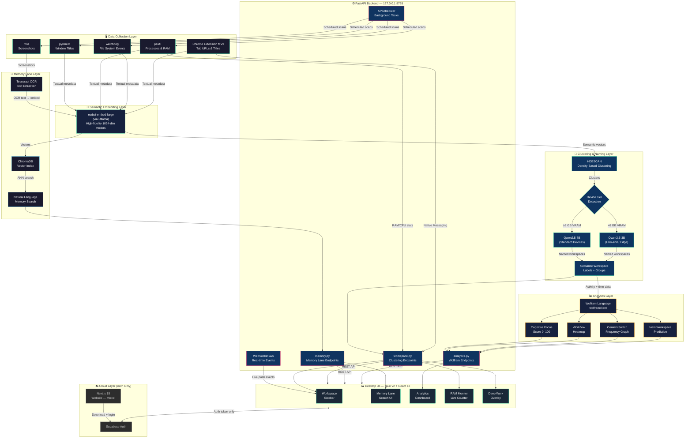

# KnemOS

> **K**nowledge · **nem**onics · **OS** — The Cognitive Layer for Your Desktop


```
  ██╗  ██╗███╗   ██╗███████╗███╗   ███╗ ██████╗ ███████╗
  ██║ ██╔╝████╗  ██║██╔════╝████╗ ████║██╔═══██╗██╔════╝
  █████╔╝ ██╔██╗ ██║█████╗  ██╔████╔██║██║   ██║███████╗
  ██╔═██╗ ██║╚██╗██║██╔══╝  ██║╚██╔╝██║██║   ██║╚════██║
  ██║  ██╗██║ ╚████║███████╗██║ ╚═╝ ██║╚██████╔╝███████║
  ╚═╝  ╚═╝╚═╝  ╚═══╝╚══════╝╚═╝     ╚═╝ ╚═════╝ ╚══════╝

  AI-Powered Semantic Workspace Operating System
```

---

## What is KnemOS?

Modern operating systems were designed **30 years ago** around files and folders.  
Today, knowledge workers live across 40+ browser tabs, multiple IDEs, local files, terminal sessions, and messaging apps — simultaneously.

**KnemOS** is a local-first AI productivity system that acts as a cognitive layer between the user and their computer. It automatically clusters your entire digital workspace into intelligent semantic groups, makes your screen history searchable in natural language, and measures your cognitive performance using Wolfram Language analytics.

> *"A cognitive operating layer between the user and their computer."*

---

## The Numbers

| Problem | Impact |
|---------|--------|
| Average tabs open per session | 40+ |
| Productive time lost daily to context switching | 20 min |
| RAM wasted on idle background tabs | 4.3 GB |
| Deep work efficiency lost to fragmentation | ~40% |

---

## Product Ecosystem

KnemOS ships as three connected systems:

```
┌─────────────────────────────────────────────────────────────┐
│                     KnemOS Ecosystem                         │
│                                                             │
│  ┌─────────────┐    ┌─────────────────┐    ┌────────────┐  │
│  │   Website   │    │  Desktop App    │    │  Browser   │  │
│  │             │    │  (Core Engine)  │    │ Extension  │  │
│  │  Next.js 15 │◄──►│  Tauri v2       │◄──►│ Chrome MV3 │  │
│  │  Vercel     │    │  FastAPI        │    │            │  │
│  │  Supabase   │    │  Local AI       │    │ Tab access │  │
│  └─────────────┘    └─────────────────┘    └────────────┘  │
└─────────────────────────────────────────────────────────────┘
```


---

## Core Features

### 01 · Semantic Workspace Clustering
AI automatically groups your browser tabs, VS Code windows, terminal sessions, and local folders into named semantic workspaces — no manual tagging, no folder creation.

```
BEFORE                         AFTER
──────                         ─────
github.com/VendorBridge    →   ● VendorBridge Dev
auth.py — VS Code          →     GitHub · FastAPI · auth.py · Terminal
FastAPI docs               →
Terminal #3                →   ● Research Workspace
Stack Overflow             →     Docs · Stack Overflow · Bookmarks
YouTube (Tab #27)          →
Gmail — 4 tabs             →   ● Communication
Slack                      →     Slack · Gmail · Notifications
```

### 02 · Memory Lane
Periodically captures screenshots, runs OCR, generates embeddings, and indexes everything into ChromaDB. Users can search their entire workspace history in natural language.

```
Search: "that React auth bug from this morning"
      ↓
Returns: screenshot · timestamp · full workspace state
```

**Pipeline:**
```
Screenshot (mss) → OCR (Tesseract) → Embed (mxbai-embed-large)
                                           ↓
Natural language query ← ChromaDB ← Vector index
```

### 03 · Deep Work Mode
AI detects off-context applications and tabs relative to the active workspace, minimizes distractions, and activates a visual focus environment.

### 04 · RAM Recovery Engine
Intelligently hibernates inactive workspaces and calculates live RAM/CPU savings. Displays a real-time counter on the dashboard.

```
Example output:  AI recovered 4.3 GB RAM · 12 tabs hibernated
```

### 05 · Predictive Productivity Analytics (Wolfram Language)
Workspace activity data is piped through Wolfram Language to generate:
- **Cognitive Focus Score** (daily 0–100 rating)
- **Workflow Heatmap** (peak productivity time-of-day)
- **Context-Switch Frequency Graph**
- **Next-Workspace Prediction**

### 06 · Context Export
Export any semantic workspace as a structured Markdown file including all links, file paths, metadata, and project context.

---

## AI Pipeline

```
Step 1 — Data Collection
  psutil (processes) + pywin32 (window titles) + watchdog (files)
  + mss (screenshots) + Chrome Extension (tab URLs)
          ↓
Step 2 — Semantic Embeddings
  mxbai-embed-large (via Ollama)
  All textual metadata → high-fidelity semantic vectors
          ↓
Step 3 — Clustering
  HDBSCAN
  Semantically related resources → workspace clusters
          ↓
Step 4 — Workspace Naming
  Ollama + Qwen2.5-7B (standard) · Qwen2.5-3B (low-end devices)
  Clusters → intelligent workspace labels
          ↓
Step 5 — Memory Indexing
  Tesseract OCR + ChromaDB
  Screenshots → searchable vector memory
          ↓
Step 6 — Workflow Analytics
  Wolfram Language (wolframclient)
  Clusters + time data → Cognitive Focus Score + predictions
```

> All processing runs on `127.0.0.1:8765` — no data leaves your machine.

---

## Technology Stack

| Layer | Technologies |
|-------|-------------|
| **Frontend** | React 18, TailwindCSS, Framer Motion, Zustand |
| **Desktop Shell** | Tauri v2 (Rust-native backend) |
| **AI Backend** | FastAPI, Python 3.11, APScheduler, WebSockets |
| **AI / ML** | mxbai-embed-large, HDBSCAN, Ollama + Qwen2.5-7B / Qwen2.5-3B |
| **Vector DB** | ChromaDB |
| **OCR** | Tesseract |
| **Analytics** | Wolfram Language, wolframclient |
| **System Monitor** | pywin32, psutil, watchdog, mss |
| **Browser Layer** | Chrome Extension MV3, Native Messaging API |
| **Auth** | Supabase Auth |
| **Website** | Next.js 15, TailwindCSS, Framer Motion |
| **Deployment** | Vercel |

### Why Tauri over Electron?

| Metric | Electron | Tauri v2 |
|--------|----------|----------|
| RAM usage | ~200 MB | ~30 MB |
| Bundle size | ~150 MB | ~10 MB |
| Backend language | JavaScript | Rust |
| Startup speed | Slow | Fast |

### Qwen2.5 Model Variants

| Variant | VRAM / RAM | Target Device | Use Case |
|---------|-----------|---------------|----------|
| Qwen2.5-7B | ~6 GB | Standard laptops / desktops | Full workspace naming & reasoning |
| Qwen2.5-3B | ~3 GB | Low-end / edge devices | Lightweight workspace naming |

KnemOS auto-detects available system memory at startup and selects the appropriate model variant.

---

## Architecture



---

## Getting Started

### Prerequisites

```bash
# System
Windows 10/11 (MVP scope)
Node.js >= 18
Python 3.11
Rust (for Tauri) — https://rustup.rs
Ollama — https://ollama.ai

# Ollama models
ollama pull mxbai-embed-large          # Embedding model
ollama pull qwen2.5:7b                 # Standard devices
ollama pull qwen2.5:3b                 # Low-end / edge devices
```

### Installation

```bash
# 1. Clone the repository
git clone https://github.com/your-username/KnemOS.git
cd KnemOS

# 2. Install Python dependencies
cd backend
pip install -r requirements.txt

# 3. Install Wolfram Engine (for analytics)
# Download: https://www.wolfram.com/engine/
pip install wolframclient

# 4. Install Tesseract OCR
# Windows: https://github.com/UB-Mannheim/tesseract/wiki
# Add to PATH

# 5. Install frontend dependencies
cd ../app
npm install

# 6. Install Tauri CLI
npm install -g @tauri-apps/cli

# 7. Install website dependencies
cd ../website
npm install
```

### Running — Development

```bash
# Terminal 1: Start AI Backend
cd backend
uvicorn main:app --reload --port 8765

# Terminal 2: Start Desktop App
cd app
npm run tauri:dev

# Terminal 3 (optional): Start Website
cd website
npm run dev
```

### Running — Production Build

```bash
# Build desktop app
cd app
npm run tauri:build

# Build website
cd website
npm run build
```

---

## Project Structure

```
KnemOS/
│
├── website/                    # Next.js 15 landing page
│   ├── app/
│   │   ├── page.tsx            # Landing page
│   │   ├── auth/               # Supabase auth
│   │   └── download/           # App download page
│   ├── components/
│   └── public/
│
├── app/                        # Tauri desktop application
│   ├── src/                    # React 18 frontend
│   │   ├── components/
│   │   │   ├── WorkspaceSidebar.tsx
│   │   │   ├── MemoryLane.tsx
│   │   │   ├── AnalyticsDashboard.tsx
│   │   │   ├── RAMMonitor.tsx
│   │   │   └── DeepWorkOverlay.tsx
│   │   ├── store/              # Zustand state
│   │   └── hooks/
│   └── src-tauri/              # Rust backend shell
│       ├── src/
│       │   └── main.rs
│       └── tauri.conf.json
│
├── backend/                    # FastAPI AI backend
│   ├── main.py                 # FastAPI entry point
│   ├── routers/
│   │   ├── workspace.py        # Clustering endpoints
│   │   ├── memory.py           # Memory Lane endpoints
│   │   └── analytics.py        # Wolfram analytics
│   ├── services/
│   │   ├── embedder.py         # mxbai-embed-large (Ollama)
│   │   ├── clusterer.py        # HDBSCAN
│   │   ├── namer.py            # Ollama + Qwen2.5-7B / Qwen2.5-3B
│   │   ├── memory_indexer.py   # ChromaDB + OCR
│   │   ├── wolfram_analytics.py
│   │   └── system_monitor.py   # pywin32 + psutil
│   ├── scheduler.py            # APScheduler tasks
│   └── requirements.txt
│
├── extension/                  # Chrome Extension MV3
│   ├── manifest.json
│   ├── background.js
│   ├── content.js
│   └── native_messaging/
│       └── knemos_host.py
│
└── README.md
```

---

## Environment Variables

```env
# backend/.env
CHROMADB_PATH=./data/chromadb
SCREENSHOTS_PATH=./data/screenshots
OLLAMA_BASE_URL=http://localhost:11434
OLLAMA_EMBED_MODEL=mxbai-embed-large
OLLAMA_LLM_MODEL=qwen2.5:7b              # or qwen2.5:3b for low-end devices
WOLFRAM_APP_ID=your_wolfram_app_id
BACKEND_PORT=8765
SCREENSHOT_INTERVAL=60                   # seconds

# app/.env
VITE_BACKEND_URL=http://127.0.0.1:8765
VITE_SUPABASE_URL=your_supabase_url
VITE_SUPABASE_ANON_KEY=your_supabase_anon_key

# website/.env.local
NEXT_PUBLIC_SUPABASE_URL=your_supabase_url
NEXT_PUBLIC_SUPABASE_ANON_KEY=your_supabase_anon_key
```

---

## API Reference

### Backend — Core Endpoints

```
POST /api/workspace/organize        Trigger semantic clustering
GET  /api/workspace/list            Get all semantic workspaces
POST /api/workspace/restore/{id}    Restore workspace state

POST /api/memory/search             Natural language memory search
GET  /api/memory/screenshots        List indexed screenshots
POST /api/memory/capture            Force capture screenshot

GET  /api/analytics/focus-score     Get Cognitive Focus Score
GET  /api/analytics/heatmap         Get workflow heatmap data
GET  /api/analytics/predictions     Get next-workspace prediction

GET  /api/system/ram                Live RAM usage + savings
GET  /api/system/processes          Running processes list
GET  /api/system/windows            Open window titles

WebSocket /ws                       Real-time workspace events
```

---

## Privacy & Security

KnemOS follows a strict **local-first privacy architecture**.

| Data Type | Storage Location |
|-----------|-----------------|
| Screenshots | Local disk only |
| Vector embeddings | Local ChromaDB |
| Workspace history | Local SQLite |
| OCR text | Local ChromaDB |
| Activity logs | Local disk only |

**Cloud only handles:**
- Authentication (Supabase)
- App updates and downloads
- (Optional) anonymous analytics

> No screenshots, embeddings, or workspace data are ever transmitted externally.

---

## Competitive Comparison

| Feature | Workona | OneTab | Arc Browser | Rewind.ai | **KnemOS** |
|---------|---------|--------|-------------|-----------|------------|
| Semantic AI clustering | ✗ | ✗ | Manual | ✗ | **✓** |
| Cross-app workspace | ✗ | ✗ | Browser only | partial | **✓** |
| Local / private | ✗ | ✓ | ✓ | ✗ cloud | **✓** |
| Screenshot memory | ✗ | ✗ | ✗ | ✓ | **✓** |
| Wolfram analytics | ✗ | ✗ | ✗ | ✗ | **✓** |
| RAM recovery | ✗ | ✗ | ✗ | ✗ | **✓** |
| Open source stack | ✗ | ✓ | ✗ | ✗ | **✓** |

---

## Roadmap

```
NOW ──────── Q3 2026 ──────── Q4 2026 ──────── 2027
 │               │                │               │
 ▼               ▼                ▼               ▼
Windows        macOS +          Enterprise     AI workflow
  MVP          Linux             deploy         prediction

Semantic       Cloud sync       Team           Voice recall
clustering     (optional)       collab         workspaces

Memory Lane    Mobile           Multi-device   Collaborative
  search       alerts           semantic       workspace
               push             sync           graphs

Wolfram        Plugin API       Enterprise     AI-generated
analytics                       SSO + audit    work summaries
```

---

## Contributing

Contributions are welcome. KnemOS is built for the open-source community.

```bash
# Fork → Clone → Branch → Build → PR

git checkout -b feature/your-feature-name
# Make changes
git commit -m "feat: your feature description"
git push origin feature/your-feature-name
# Open Pull Request
```

**Areas actively needing contribution:**
- macOS system integration (pyobjc)
- Linux window management (xdotool / wnck)
- Wolfram analytics notebook templates
- Browser extension for Firefox

---

## License

MIT License — see [LICENSE](./LICENSE) for details.

---

## Acknowledgements

Built with:
- [Tauri](https://tauri.app) — Rust-native desktop framework
- [mxbai-embed-large](https://www.mixedbread.ai/blog/mxbai-embed-large-v1) — High-fidelity local semantic embeddings
- [HDBSCAN](https://hdbscan.readthedocs.io) — Density-based clustering
- [ChromaDB](https://www.trychroma.com) — Local vector database
- [Ollama](https://ollama.ai) — Local LLM inference
- [Qwen2.5](https://qwenlm.github.io/blog/qwen2.5/) — Local workspace naming LLM (7B / 3B)
- [Wolfram Language](https://www.wolfram.com/language/) — Computational intelligence
- [Tesseract OCR](https://github.com/tesseract-ocr/tesseract) — Screen text extraction
- [psutil](https://psutil.readthedocs.io) — System process monitoring

---

<div align="center">

**KnemOS** · OSC AI Build 1.0 · Future of Productivity Track

*The cognitive layer your OS never had.*

[knemos.dev](https://knemos.dev) · [GitHub](https://github.com/your-username/KnemOS)

</div>
